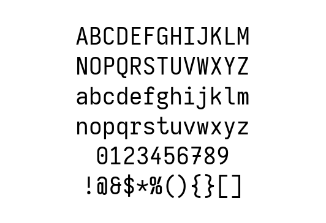
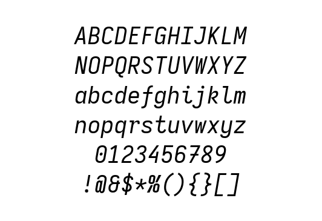

k.iosevka
---------

A custom build of [Iosevka][iosevka] for personal use. A preview of the
typeface can be found at [Julia as a CLI calculator][julia]




Build
=====

The compiled fonts can be found on the [release][release] page, but just in
case you want to build it yourself, here is the instructions:

First, [npm][npm], [ttfautohint][ttfautohint], [otfcc][otfcc], [AFDKO][afdko]
are required to build this typeface. If you are using Arch Linux and
[`yay`][yay], the dependencies can be installed via AUR.

```bash
$ yay -S npm otfcc ttfautohint afdko
```

Then, use the makefile to take care of everything.

```bash
$ make setup
$ make build
```

The output is in the `out` directory.

Nerd fonts patch
================

The `term` variant is intended to be used in the terminal, and it is sometimes
necessary to patch the font with [Nerd fonts][nerd] to add additional symbols
for various terminal applications.

[`fontforge`][fontforge] and [subversion][svn] are required to apply the patch.
I'm using subversion here only because it is a pain to download a single folder
from GitHub. Follow the instruction in `Makefile` if you want to use `git`
instead. Otherwise, install the dependencies via
```bash
$ yay -S fontforge subversion
```
Then run the patcher by
```bash
$ make setup-nerd
$ make patch
```
The patched fonts can be found in the `patched` directory. They are internally
referenced by the name `k.iosevka.term Nerd Font`.

[iosevka]: https://typeof.net/Iosevka/
[julia]: https://krasjet.com/rnd.wlk/julia/
[release]: https://github.com/Krasjet/k.iosevka/releases

[npm]: https://www.npmjs.com/
[ttfautohint]: http://www.freetype.org/ttfautohint/
[otfcc]: https://github.com/caryll/otfcc
[afdko]: https://adobe-type-tools.github.io/afdko/AFDKO-Overview.html
[yay]: https://github.com/Jguer/yay

[nerd]: https://github.com/ryanoasis/nerd-fonts
[fontforge]: https://fontforge.org
[svn]: https://subversion.apache.org/
