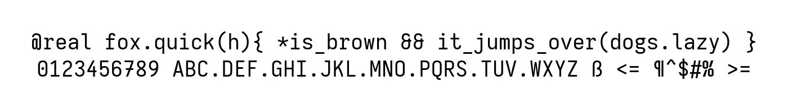

# k.iosevka

<p align="center">
  
</p>

A custom build of [Iosevka](https://typeof.net/Iosevka/) for personal use.

## Build

[npm](https://www.npmjs.com/),
[ttfautohint](http://www.freetype.org/ttfautohint/),
[otfcc](https://github.com/caryll/otfcc),
[AFDKO](https://adobe-type-tools.github.io/afdko/AFDKO-Overview.html) are
required to build this typeface. If you are using Arch Linux, they can be
installed on AUR.

```bash
$ yay -S npm otfcc ttfautohint afdko
```

Then, use the makefile to take care of everything.

```bash
$ make setup
$ make build
```
